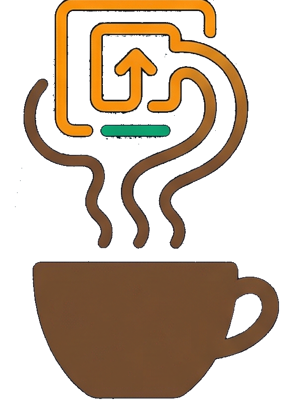
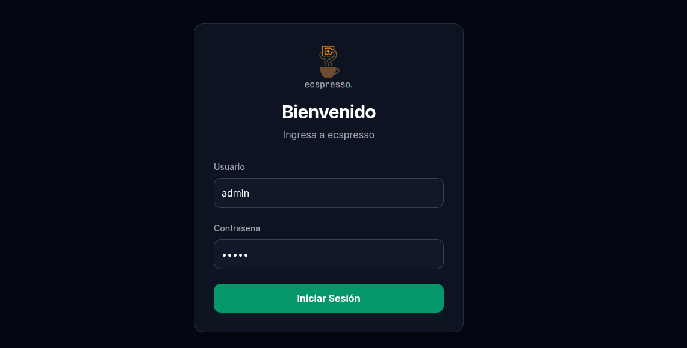
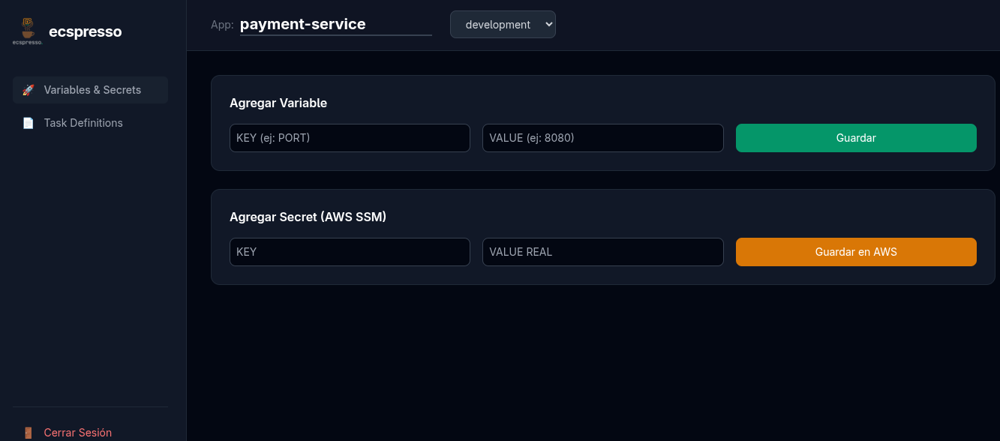
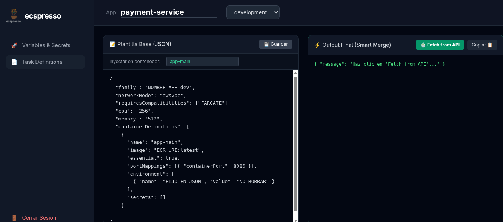

# ☕ ecspresso

[](https://python.org)
[](https://fastapi.tiangolo.com)
[](https://docker.com)
[](LICENSE)

<p align="center">
  
</p>

**ecspresso** is a DevOps tool designed to centralize and automate the management of environment variables, secrets (AWS SSM), and container *Task Definition* templates for deployments on Amazon ECS (Elastic Container Service).

It allows Development and DevOps teams to manage configurations for multiple applications and environments (`development`, `staging`, `production`) through a robust API and an interactive, visually stunning Command-Line Interface (CLI).

---

## 🚀 Key Features

- **Centralized Management:** Define all your base ECS JSON container templates in one place.
- **Variables & Secrets Merging:** Automatically injects environment variables and secret references (from AWS Systems Manager Parameter Store).
- **Rich CLI Tool:** Built with `click` and `rich` to provide syntax-highlighted and colored console outputs directly in your terminal.
- **Dual Authentication:**
  - Web UI protected by **JWT** and Password Hashing (`bcrypt`).
  - API protected by **API Key** (perfect for automated use in CI/CD pipelines and by the CLI).
- **Production Ready:**
  - Containerized App (unprivileged `Dockerfile`).
  - Dedicated Health Check endpoint (`/health`).
  - Easily deployable locally with `docker-compose`.
  - Clean Database Abstraction Layer (Repository / CRUD Pattern).

## 📸 Interface Preview

<div align="center">
  
  
  
</div>

---

## 🔒 How Secrets Work

A core philosophy of `ecspresso` is keeping sensitive data out of plain text files. Here is how it handles configuration:

| Type | Storage | ECS Behavior |
|---|---|---|
| **Environment Variables** | Kept in `ecspresso` PostgreSQL DB | Injected into ECS as plain-text `environment` key/value pairs |
| **Secrets** | Created/Stored in AWS SSM Parameter Store | Injected into ECS as `secrets` utilizing their internal SSM ARN `valueFrom` |

> ⚠️ **IAM Permissions Note:** `ecspresso` manages configurations but **does NOT deploy** them. It only merges the templates to produce the valid JSON. Your deployment tool (GitHub Actions, Jenkins, CLI) will take this JSON and push it to AWS. Therefore, `ecspresso` only needs permissions to write to *SSM Parameter Store*. It does not require `ecs:RegisterTaskDefinition` or any compute privileges.

---

## 🏃‍♂️ Installation & Quick Start

### 1. Environment & AWS Configuration (SSM)
This project uses a `.env` file to manage secrets, Database credentials, and AWS configurations securely.

Copy the example file to create your local environment:
```bash
cp .env.example .env
```
Ensure you provide AWS credentials so `boto3` can interact with the Parameter Store:
- `AWS_ACCESS_KEY_ID`
- `AWS_SECRET_ACCESS_KEY`
- `AWS_REGION`

### 2. Spin Up Local Infrastructure

Clone the repository and bring up both the PostgreSQL database and the API using Docker Compose. Using `--build` ensures your image is built from scratch securely without root privileges.

```bash
sudo docker compose up -d --build
```
The FastAPI backend will now be exposed at `http://localhost:8000`.

### 3. Populate Database (Seed)
To log in locally or inspect pre-loaded data, run the main seed script against the container.

```bash
sudo docker exec -it ecspresso-api-1 python seed.py
```
*(This sets up the `admin` user with the password `admin`)*

**Mock Data (Optional Test):**
To load fake data (`payment-service` template with local mock variables and secrets) without hitting real AWS infrastructure:
```bash
sudo docker exec -it ecspresso-api-1 python seed.py --mock
```

---

## 💻 Usage in CI/CD & Local CLI

Both your local CLI and CI/CD pipelines use **API Key** authentication. 

### 1. Pipeline / Local CLI Setup
Configure your environment by injecting the raw API Key text:
```bash
export ECSPRESSO_API_KEY="my-super-secret-key"
export ECSPRESSO_URL="http://localhost:8000"
```
*(In GitHub Actions, you would map a GitHub Secret into the job's `env:` block).*

### 2. CLI Commands - Configuration

#### Manage Environment Variables
Creates the application (if it doesn't exist) and registers a plaintext variable:
```bash
python cli.py set-var --app my-app --env development --key DB_HOST --value localhost
```

#### Manage Secure Secrets
Creates an AWS SSM Parameter Store secret and returns the ARN reference:
```bash
python cli.py set-secret --app my-app --env development --key DB_PASSWORD --value supersecret
```

### 3. CLI Commands - Generation

#### Get Task Definition
Generates the final ECS JSON with variables and secrets merged.

```bash
python cli.py td get --app payment-service --env development -o custom_task.json
```

**Example Output Generated:**
```json
{
  "family": "payment-service-dev",
  "networkMode": "awsvpc",
  "containerDefinitions": [
    {
      "name": "payment-backend",
      "image": "12345678..dkr.ecr.us-east-1.amazonaws.com/payment:latest",
      "environment": [
        {
          "name": "DB_HOST",
          "value": "postgres-dev.internal"
        }
      ],
      "secrets": [
        {
          "name": "DB_PASSWORD",
          "valueFrom": "arn:aws:ssm:us-east-1:123456789012:parameter/payment-service/development/DB_PASSWORD"
        }
      ]
    }
  ]
}
```

---

## 🔗 Deep Dive API Endpoints

| Method | Endpoint | Description | Auth Required |
|---|---|---|---|
| `GET` | `/` | UI HTML Dashboard | - |
| `GET` | `/health` | Health Check (verifies DB instance) | - |
| `POST`| `/api/v1/auth/login` | Login and grant JWT Token | None |
| `POST`| `/api/v1/variables` | Upsert an application variable | *JWT* or *API Key* |
| `POST`| `/api/v1/secrets` | Push to AWS SSM and track ARN | *JWT* or *API Key* |
| `GET` | `/api/v1/apps` | List all tracked applications | *JWT* or *API Key* |
| `POST`| `/api/v1/apps/{app}/td/template`| Create/Update the base JSON template | *JWT* or *API Key* |
| `GET` | `/api/v1/apps/{app}/td` | Compile variables & secrets into valid JSON | *JWT* or *API Key* |

---

## 🔐 Design & Security Notes

- **Docker:** Runs under an isolated `appuser` (non-root execution).
- **Passwords:** UI credentials are encrypted via standard 1-way hashing (`bcrypt`). 
- **API Keys:** Pipeline keys are stored strictly in configuration/env hashed; never logged.

*Built to improve developer experience in modern DevOps Ecosystems.*
